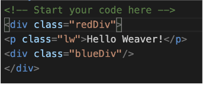
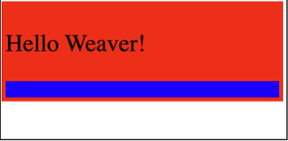
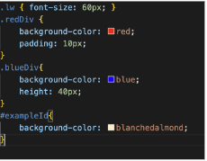
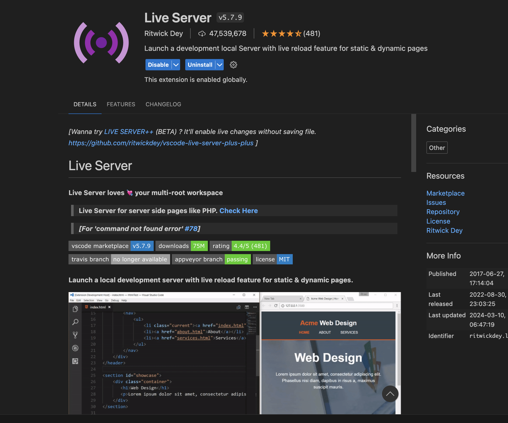
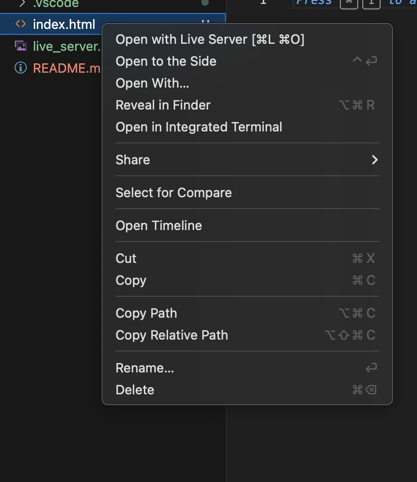
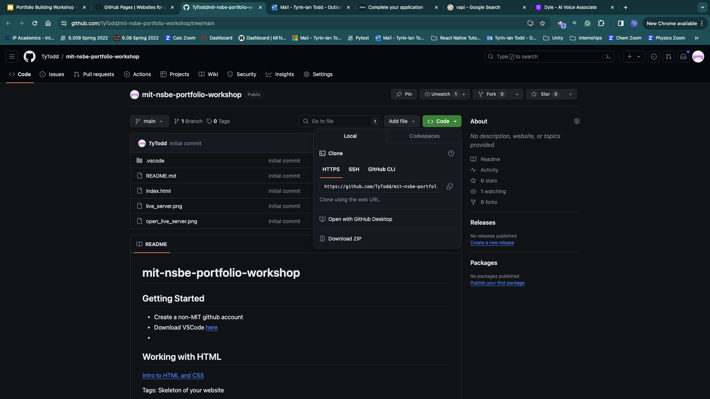

# mit-nsbe-portfolio-workshop

## Getting Started

- Create a non-MIT github account
- Download VSCode [here](https://code.visualstudio.com/download)
- Download git [here](https://git-scm.com/downloads)
- Pick a **static** html template website from any of these options \*must be a **STATIC HTML** website\*
  - [HTML5 UP](https://html5up.net/)
  - [HTML Rev](https://htmlrev.com/free-html-templates.html)
  - [Start Bootstrap](https://startbootstrap.com/)
  - Any other website you find online

## Working with HTML

[Intro to HTML and CSS](https://easyhtmlcss.com/lessons/01-html-intro)

Tags: Skeleton of your website

- \<div> block
- \<span> inline element
- \<p> paragraph
- \ image
- \<h#> heading
- \<a> link

The nested and ordered structure of HTML is directly related to how it renders on the website
Here is some example HTML code:



And here is what it looks like rendered



## Style up with CSS

You can map elements to classes and ids to style them up.
Look for a .css file in your project folder.
Here is an example of what css looks like. .blueDiv is a class and #exampleId is an ID



## Working with Markdown

Fun fact: This README is written in Markdown!

In HTML there are lots of tags and text and styling which can lead to really long files and hard to read code. Markdown is a easier way to write content for the web. Think of markdown as if HTML and plain text had a baby. It's a really easy to convert from how humans write pages to how computers render them. You will use markdown to make the write-ups for your project pages.

Here is an example of how tow write a markdown file:


## Convert markdown to HTML

### Intallation

To convert you must first install pandoc. You can do this by running the following command in your terminal:

#### Installer

You can download the installer from the [pandoc website](https://pandoc.org/installing.html)

#### Mac

Fist make sure you have homebrew installed. If you don't you can install it by running the following command in your terminal:

```bash
/bin/bash -c "$(curl -fsSL https://raw.githubusercontent.com/Homebrew/install/HEAD/install.sh)"
```

```bash
brew install pandoc
```

#### Windows

Must have chocolatey installed. If you don't you can install it using the guide on the [chocolatey website](https://chocolatey.org/install)

```bash
choco install pandoc
```

Now you can convert your markdown file to HTML by running the following command in your terminal:

```
pandoc --toc --standalone --mathml -f markdown -t html markdown.md -o writeup.html
```

## Getting to know your website

Lets get to know your website. Download [VS Code](https://code.visualstudio.com/download) if you haven't already to start editing.

### Locally Testing

Add and enable the extension live server


Now you can right click on the .html file you wish to see and select "Open with Live Server"


You should see your website open in your default browser.

### Your website structure

Your website is made up of a few files and folders. Each folder corresponds to a _path_ on your website. The path is the URL that you type into your browser to get to a specific page. The main page of your website is the `index.html` file. This is the file that will be displayed when you go to the root of your website. Or in other words, when you go to `https://your-website.com/`. Your path can get more specific with folders. For example, if you have a folder called `projects` the `index.html` in that folder will be displayed when you navigate to `https://your-website.com/projects`.

## Add your write up to your page

Place your writeup.html file into the folder for the page you are adding it to. Then open your index.html file and add the following code to the bottom of the `<body>` section

```html
<script>
  // Load included_content.html into #includedContent div
  fetch("./writeup.html")
    .then((response) => response.text())
    .then((html) => {
      document.getElementById("writeup").innerHTML = html;
    });
</script>
```

This loads the file content onto the page and will display it inside of a div where the id is `writeup`. The last step is to place this div wherever you want your writeup inside your index.html

```html
<div id="writeup"></div>
```

## Deploy

Create a git repo using the following tutorial and push your code to it.
[https://pages.github.com/](https://pages.github.com/)

### Pushing code to github

After creating your repo using the tutorial above you can push your code to github by running the following commands in your terminal:

First you must get the remote url of your repo

Copy that url then run the following commands in your terminal:

```bash
git init
git remote add origin URL
git branch -M main
git add .
git commit -m "first commit"
git push -u origin main
```
